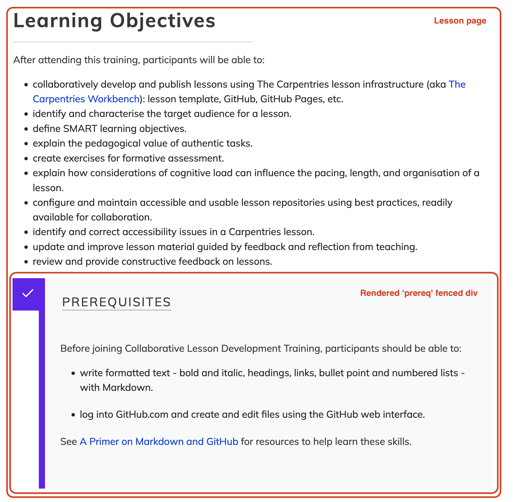
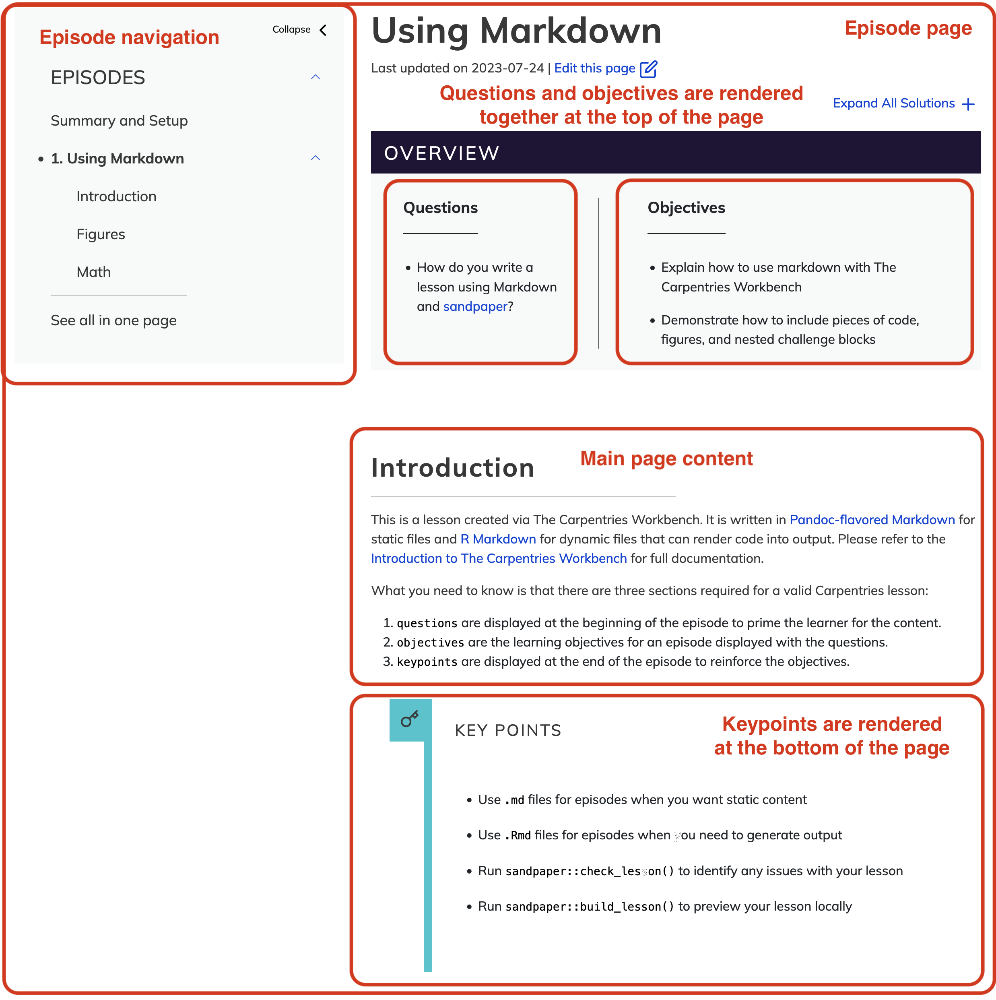

::::::::::::::::::::::::::::::::::::::: objectives

After completing this episode, participants should be able to...

- Add lesson episodes as individual pages of a lesson website.
- Use _fenced divs_ to create different structural elements within a page to 
format objectives, questions, keypoints, exercises and their solutions in a lesson website.

::::::::::::::::::::::::::::::::::::::::::::::::::

:::::::::::::::::::::::::::::::::::::::: questions

- How do you create and modify the pages in a lesson?
- How should different structural elements be presented in a lesson website?
- How can you include quality control in the editing process on GitHub?

::::::::::::::::::::::::::::::::::::::::::::::::::


Now that we have completed the basic configuration of a lesson site,
it is time to move on and look at where the actual lesson content will be written.

As we have seen previously, lesson content is composed using Markdown (or R Markdown),
a lightweight markup language that simplifies the formatting of plain text. 
While Markdown provides structured elements like headings, lists, links, images, and code blocks, 
the Workbench enhances this by allowing the creation of additional structured text blocks that 
visually stand out from standard paragraphs on lesson websites. 
These elements, known as *fenced divs*, will be demonstrated shortly.

Let's start by writing our lesson's home page.

## Lesson Home Page

The "home page" of a lesson is created from the `index.md` file:
this file should contain a brief introduction to the lesson,
designed to give visitors to the page a first impression of the lesson
and whether it is appropriate for them.
The file begins with a short header,
written in the same key-value pair syntax we encountered in `config.yaml`.

```markdown
---
site: sandpaper::sandpaper_site
---

```

This header configures how the site will be built by `sandpaper`, one of the components of 
The Carpentries Workbench, and should be left untouched.
The page content begins after the blank line that follows this header.

To get started on this home page, let's replace the template text in `index.md` with
the same short description of your lesson you added to your `README.md`.

After that, it might be a good idea to add your lesson objectives to our lesson's homepage.

::::::::::::::::::::::::::::::::::::::  challenge

## Exercise: more practice editing Markdown in GitHub

Add the objectives you defined for your lesson
as a bullet list in the `index.md` file of your lesson repository.

::::::::::::::::::::::::::::::::::::::::::::::::::

Below those, let's add the prerequisite skills you determined earlier for your lesson. 
While you can add them as a bullet point list, the Workbench provides a special formatted block 
for prerequisites, so they appear visually distinct on the page.

::: callout 

### Fenced divs

Fenced divs are structural elements within the page, which get rendered in a visually distinct 
way on the lesson website.
Fenced divs include regular Markdown content surrounded by special tags to mark 
the start and the end of such a block. 

To mark the beginning of a fenced div, start a line with an opening tag - at least 3 colon characters 
followed by a blank character and a keyword denoting the type of a fenced div you are 
creating (`::: fenced_div_keyword`) . 
Then you add the Markdown content of this structural block. 
Finally, end your fenced div with a closing tag consisting of at least 3 colons (`:::`).

[There are many types of fenced divs available in the lesson infrastructure](https://carpentries.github.io/sandpaper-docs/instructor/component-guide.html#callout-blocks)
and we will explore most of them in this episode.
:::

:::::::::::::::::::::::::::::::: spoiler

### Markdown Rendering on GitHub

You might have noticed by now that GitHub provides
a preview of content in Markdown files,
and displays an interpreted ("rendered") version of Markdown file content
by default in its web interface.
You might also notice that the content of `index.md` is displayed differently
when viewed on GitHub
from how it appears on the homepage of your lesson website:
the yaml header mentioned above appears in a tabular layout on GitHub,
but is not visible on the lesson homepage.

This is because the lesson infrastructure accepts an expanded set of
elements in the source Markdown files:
syntax for components of a lesson website
that are not part of the standard set of Markdown features,
e.g. page metadata such as the YAML header above,
or fenced div blocks to make certain content visually distinctive.
In these cases, you may see GitHub render the content differently
from how it appears on your website, or not at all.

We will encounter more examples of this throughout the lesson,
but the important thing to remember for now is that
**how GitHub displays source (R) Markdown files is not a reliable indicator
of how content will be displayed in your website**.

::::::::::::::::::::::::::::::::::::::::

## Proposing Changes with Pull Requests

:::::::::::::::::::::::::::::::::::::::::::::::::: instructor

### Decide Whether to Teach This Section
We have found that trainees bring a wide range of experience with GitHub to this training.
Before teaching the pull request workflow, it is worth checking how familiar trainees already are with this way of working.

If all trainees are already comfortable with opening pull requests to suggest changes to a repository, you can save time by skipping this section altogether.

:::::::::::::::::::::::::::::::::::::::::::::::::::::::::::::

So far, we have been editing the files in our lesson repository directly.
This is a quick way of working and pretty safe for simple and small changes, especially when your whole lesson team is present (like in this training).
But it has a number of drawbacks:

1. There is not much opportunity for quality control: if you make typos or other mistakes, those will be directly published in your lesson as soon as the site finishes building.
2. There is little room for discussion of potential changes.
3. Only one person can work on a given file at the same time without risking the introduction of conflicting changes.

GitHub offers a workflow for making changes that can be very powerful for collaborative teams, especially those whose members often work on the project asynchronously: pull requests.
A pull request is a way of proposing changes to one or more files in a project so that they can be reviewed, discussed, and adjusted before they are included in the main version (in our case, the lesson website).
It can be helpful to think of pull requests like the "Suggest changes" feature of collaborative writing platforms like GoogleDocs.

Pull requests work through a feature of the Git version control software called _branches_.
A project can have multiple branches, which each represent a particular state of the project as a whole.
We briefly encountered branches when we were configuring our lesson repository in the previous episode: when we make changes to the `main` branch of the project, the files in that branch are processed by the lesson build workflows and deposited as webpage source code into the `gh-pages` branch, which is then served to the internet.

When you want to make some more changes to the project, you can create a new branch to contain those changes before opening a pull request to propose the inclusion of your changes into the `main` version of the project.
The pull request interface then allows your fellow team members to explore and comment on the changes you propose, and decide whether/when to include them.

### Opening a pull request
Let's make another change to the `index.md`, this time via a pull request.

To add a "prerequisite" block to `index.md`, we use a fenced div called `prereq` like this:

```markdown
::: prereq
- prerequisite 1
- prerequisite 2
- ...
:::
```

When commiting these changes to the `index.md`, we can choose the "Create a new branch for this commit and start a pull request" option.
It can be helpful to choose a descriptive name for the branch.

* After pressing "Propose changes", you will be prompted to open a pull request.
* Choose a title for your pull request, e.g. "Add prerequisites to index.md" and write a short description of the changes you are proposing.
* After pressing "Create pull request", your proposed changes will be presented to your other team members (and anybody else who visits the project).

Team members who have been granted access to the repository as collaborators will be able to do several things with this pull request:

1. Review and comment on the proposed changes, via the "Files changed" tab of the pull request.
2. Discuss the pull request in the "Conversation" tab.
3. _Merge_ i.e. accept the changes into the `main` branch of the project to be built into the content of the lesson website.

:::::::::::::::::::::::::::::::::::: instructor

### Reviewing the Pull Request
Ask your co-Trainer to briefly demonstrate the process of reviewing and merging this pull request.
Since a more in-depth discussion of pull request reviews is included in the GitHub Skill-up, the demonstration here can be limited to viewing the changes in the "Files changed" tab, writing an approving message, and merging the changes.

:::::::::::::::::::::::::::::::::::::::::::::::

Once the changes have been merged and your lesson site rebuilds, check how prerequisites block appears on your lesson's home page. 
A screenshot below provides an example.

{
alt="Lesson prerequisite fenced div structural block as rendered in a Web page by the Workbench"
}

You will have an opportunity to practice this pull request workflow in the next section of the training.

## Episodes

The main body of the lesson is written in _episodes_:
the individual chunks or sections that the lesson is separated into.
The episode pages of the lesson site will be constructed from Markdown or R Markdown files
in the `episodes` folder of the lesson repository.

The `episodes` folder of the new repository contains a single example episode file,
`introduction.md`.
The content of this file includes some help with and examples of how to write Markdown files
for The Carpentries Workbench.
Like `index.md`, the episode file begins with a short header.
The fields in this header describe the episode title and the estimated time (in minutes)
required to teach it and complete the exercises.

### Creating a new episode

Let's create a new episode file, for one of the episodes you have identified earlier in the training.
First, open the "raw" view of the `introduction.md` example episode,
and copy its contents to make it easier to structure the new episode we are creating.

::: instructor

You may ask each trainee in a lesson team to create an episode file for the episode they are responsible for.
Encourage participants to use pull requests here, to ensure that they do not create conflicts e.g. by editing the same file or creating files with identical names.
Or ask them to observe only and not to follow along while you demonstrate this the first time: they will have an opportunity to practice the steps for themselves in an upcoming exercise.

It may feel awkward to open separate pull requests for the creation of an episode file and the addition of that episode to the lesson navigation, but the cognitive load of teaching how to include changes to mutiple files in the same branch from within the GitHub web interface may be too great.
Use your judgement of participants' familiarity and comfort with GitHub when deciding how to present this and how much detail to go into.
Remember that a separate GitHub Skill-up exists to teach them a more efficient way of using the platform to work collaboratively.

:::

```markdown
---
title: "Intro to Markdown"
teaching: 10
exercises: 2
---

:::::::::::::::::::::::::::::::::::::: questions 

- How do you write a lesson using Markdown and `{sandpaper}`?

::::::::::::::::::::::::::::::::::::::::::::::::

::::::::::::::::::::::::::::::::::::: objectives

- Explain how to use markdown with The Carpentries Workbench
- Demonstrate how to include pieces of code, figures, and nested challenge blocks

::::::::::::::::::::::::::::::::::::::::::::::::

## Introduction

This is a lesson created via The Carpentries Workbench. It is written in
[Pandoc-flavored Markdown](https://pandoc.org/MANUAL.txt) for static files and
[R Markdown][r-markdown] for dynamic files that can render code into output. 
Please refer to the [Introduction to The Carpentries 
Workbench](https://carpentries.github.io/sandpaper-docs/) for full documentation.

...

::::::::::::::::::::::::::::::::::::: keypoints 

- Use `.md` files for episodes when you want static content
- Use `.Rmd` files for episodes when you need to generate output
- Run `sandpaper::check_lesson()` to identify any issues with your lesson
- Run `sandpaper::build_lesson()` to preview your lesson locally

::::::::::::::::::::::::::::::::::::::::::::::::
```

You may have noticed a few more fenced divs in the episode file - `questions`, `objectives` and
`keypoints`.
These are all compulsory elements of every episode - the Workbench will refuse to build your
lesson if any of these are missing.

Now open a new pull request to create a new file in the `episodes` folder.
Based on the episodes you planned out earlier,
choose a name for your episode that concisely describes the intended content,
e.g. `data-visualisation.md`
(or `data-visualisation.Rmd` for a lesson based on R Markdown).
It is vital to include the file extension when naming this file:
only files with the `.md` or `.Rmd` extensions will be built into
webpages by the lesson infrastructure.

For the content of your episode, paste everything from the `introduction.md` file you copied earlier and:

1. replace the title in the header with the title of your episode
2. set the `teaching` and `exercises` fields to zero for now
3. replace the contents of the `questions` div with the questions for your episode you defined earlier
4. replace the contents of the `objectives` div with the episode-level objectives you defined earlier 
5. replace the contents of the `keypoints` div with the key points for your episode you defined earlier
6. Ignore or delete the rest of the content of the episode (i.e. only focus on the three structural elements - questions, objectives and keypoints).

### Adding a new episode to the lesson navigation

This new episode will not yet appear in the navigation of your lesson site, even after the pull request has been merged.
To enable this, we need to specify where the episode should appear
in the order of the lesson.
That episode order is defined in the `episodes` field of the `config.yaml` file:

```YAML
# Order of episodes in your lesson
episodes:
- introduction.md

```

Add the name of the new episode file you created to this list in `config.yaml`
and open a new pull request to commit this change, for example:

```yaml
# Order of episodes in your lesson
episodes:
- introduction.md
- data-visualisation.md

```

After the pull request has been merged and the lesson site has been rebuilt on GitHub,
you should see the episode title appear under _EPISODES_
in the left sidebar navigation of your lesson site
after refreshing the webpage.
Clicking on that title will take you to the episode page built from the file you created.
At the top of the page body, you will find the episode title
and an _Overview_ box containing a list of the questions and objectives
defined for the episode. 
At the bottom of the page, you will find the keypoints. 
Later, we will add more content to your chosen episodes.

{
alt="A rendered lesson episode page showing objectives, questions and keypoints fenced div elements"
}


::::::::::::::::::::::::::::::::::::::  challenge

## Exercise: practice creating episodes (10 minutes)

Repeat the steps you just saw, to create another new episode file and add it to the lesson site navigation.
Propose these changes as pull requests when you do so.
If you know what another episode in your lesson will be about, create the page for that.
Otherwise, feel free to use any values you like for the file name and episode title.

::::::::::::::::::::::::::::::::::::::::::::::::::

Using this approach, we can build up our lesson one episode at a time.


::::::::::::::::::::::::::::::::::::::::::::::::: instructor

### Working on the same episode or file - possible conflicts

As we move onto adding more content into trainees' lesson repositories, it is quite possible that two or more trainees will be working on the same episode. 
This could lead to conflicts if they are editing the same portion of the episode simultaneously. 

Embrace this if it happens in the training! 
It is a good opportunity to mention to trainees that this is a common scenario when working collaboratively and to guide them through steps that need to be taken to resolve conflicts.

Now may also be a good opportunity to mention that, instead of editing files on the main branch, it is better when collaborators work on separate development branches. 
This enables them to work in parallel without constantly resolving conflicts and having to deal with them in the middle of ongoing work. 
While using branches does not eliminate conflicts entirely, it delays them until collaborators are ready to integrate their changes into the main branch.
This is done via pull requests (PRs) - which will be covered later in this episode.

::::::::::::::::::::::::::::::::::::::::::::::::::::::::::::


## Adding Exercises

To create an exercise in The Carpentries Workbench,
we use two types of fenced div:

* `challenge`, where the main task is a problem to be solved.
* `discussion`, where the main task is for participants to discuss a topic or prompt

To start a `challenge` fenced div, write an opening tag of at least 3 colons as usual, then follow it with the `challenge` keyword.
Add the content of the challenge on the following lines.
Finally, close the fenced div using another line with least 3 colons.

```markdown
:::::::::::::::::::::::::::::::::::::: challenge

### Challenge Title

Challenge text, code, and other information goes here

::::::::::::::::::::::::::::::::::::::::::::::::::

```

If you also want to include an expandable solution box for the challenge you can
nest a `solution` fenced div within the `challenge` div.
The format is the same as for a challenge except the fenced div tag is `solution` instead.
Note the solutions can all be expanded for more accessible reading using the "Expand All Solutions"
option at the top of each episode.


```
:::::::::::::::::::::::::::::::::::::: challenge

### Challenge Title

Challenge text, code, and other information goes here

:::::::::::::: solution

### Solution Title

Solution text, code, and other information

:::::::::::::::::::::::::

::::::::::::::::::::::::::::::::::::::::::::::::::

```

For readability, you may want to have the length of the closing lines match the opening lines.
See in the above how the challenge and the nested solution's closing lines are similar lengths to the their corresponding opening lines.
For more information about creating exercises see the [Workbench Documentation for Exercises](https://carpentries.github.io/sandpaper-docs/episodes.html#exerciseschallenges).

::::::::::::::::::::::::::::::::::::::  challenge

## Exercise: Formatting Exercises in a Lesson Site (15 minutes)

Using the approach demonstrated above,
format the exercise you designed previously as an exercise in your lesson site.


::::::::::::::::::::::::::::::::::::::::::::::::::


## Important, Optional and Cautionary Material

The Carpentries Workbench includes a fenced div for highlighting key material that should not be 
skipped during instruction using the `callout` keyword.

:::::::::: callout

## Calling Attention to Important Points

For important points in the lesson, you can add them to a `callout` box to emphasize their importance.

:::::::::::::


There is also a fenced div for optional content that can be covered if time permits (`spoiler` keyword).

::::::::::::::::::::::::::::::::::::::::  spoiler

## Using Spoilers for Optional Materials

Often lessons have more content than can be reasonably taught in the amount of time allotted.
This is especially true for collaboratively developed lessons as each contributor/instructor may have additional items they'd like to see included, leading to "scope creep".

To address this issue, in many Carpentries lessons, `spoiler` boxes are used for asides and short tangents, e.g. points that might be relevant to some audiences but are not essential to the flow of the lesson.
These spoilers should still be kept to a minimum as they can be disruptive to instructors and readers.

Note, this use of the spoiler box is to use the expandable box functionality as nothing will be "spoiled" by expanding this box.
Also, note that the spoiler box titles should be very clear so instructors need not expand the spoiler to know if they want to teach that extra.

::::::::::::::::::::::::::::::::::::::::::::::::::

You may notice that many of the older lessons use callouts for both additional material and to highlight important points interchangeably. Spoilers were developed in 2023 to help with separating these two different use cases.

Finally, the Workbench also supports the `caution` fenced dev, which can be used to draw attention 
to common pitfalls, potential issues or otherwise emphasise something that might negatively impact the user.

::::::::::::::::::::::::::::::::::::::::  caution

### Calling Attention to Potential Problems

Be careful to close an opened fenced div with at least three colons (`:::`) to avoid failed lesson builds.

::::::::::::::::::::::::::::::::::::::::

## Glossary of Terms 

You have already started on compiling a glossary of terms for your lesson. 
The Workbench offers a standardized location for lesson terminology: `learners/reference.md`.


## More Practice with Lesson Content

::::::::::::::::::::::::::::::::::::::  challenge

## Exercise: More Practice (15 minutes)

Use this time to add more content to your lesson site.
Generally speaking, you should try to transfer the drafted content from your lesson design notes into the lesson website.
Here are some suggestions for things you might try:

1. Add other exercises - e.g. add a `discussion`. Note that the lesson infrastructure does not support `solution` divs attached to `discussion`s.
2. [Add some tabbed content](https://carpentries.github.io/sandpaper-docs/episodes.html#tabbed-content) in your episode. 
3. Start a glossary of terms in the `learners/reference.md` file, referring to [the Workbench documentation on how to add a list of term definitions](https://carpentries.github.io/sandpaper-docs/editing.html#learners).
4. Look through the [Workbench component guide](https://carpentries.github.io/sandpaper-docs/instructor/component-guide.html) and try implementing some of the other flavours of fenced div.
5. Add a new Markdown file to the `learners/` or `instructors/` folder and see if you can find the built page in your lesson site.

::::::::::::::::::::::::::::::::::::::::::::::::::

## Troubleshooting the Lesson Build

::::::::::::::::::::::::::::::::::::::::::::::::::::::::::: instructor

### Troubleshooting the Lesson Build (~10 mins)

This is a good opportunity to pause and check in on
how well trainees' lesson builds are running.
If anyone is having trouble with their workflows,
ask them to share their screen
and try following the troubleshooting steps to diagnose and fix the issue.

This is also a good opportunity to show what the GitHub actions look like when they are in progress, 
succeed, or fail if you haven't already.

If all is well, and you are pressed for time, this section can be skipped.

::::::::::::::::::::::::::::::::::::::::::::::::::::::::::::::::::::::

Sometimes, formatting errors and typos in the files of your repository can
cause the process that builds your lesson website to fail.

You will likely first notice the failure to build the lesson if the lesson website is not showing the changes you made.
You may also receive an email from GitHub about the build failure if that is your preferred way of receiving notifications
(but it may take you some time to realise this).
The good thing is that GitHub keeps your previous lesson version online
until the error is fixed and a new build is completed successfully.
If you are not yet familiar with the GitHub interface,
it can be difficult to pinpoint the problem.

Here are some points of advice that you can follow to help
find and fix the problem when you notice the build process fail.

- When you first notice that there is a problem, **stop** editing your lesson:
  any subsequent changes that you make will not be included in your lesson site until
  the problem is fixed, and might introduce additional issues,
  making it more difficult to find the original cause.
- **Look at the history** of commits
  (the link with a reversing stopwatch icon and "NN commits"
  at the top of the listing of files and folders in the repository homepage).
  Is there a place where the build has a red cross instead of green circle?
  If so, click on that commit to look at the "diff"
  (where it shows which lines have been modified).
  The error is likely to have been introduced by these changes.
- **Ask for help**: you can open an issue on your repository and tag a member of
  The Carpentries team to ask for help finding the problem.
  Alternatively, you can also ask for help in The Carpentries
  Slack workspace.
  (More about communication channels for discussing lesson development coming later in this training.)
- Waiting for the GitHub Actions process that builds the website to run can be tedious,
  and slow down the process of troubleshooting:
  it can take a few minutes for the process to reach the point where it encounters the problem.
  It can be helpful to download the files for your lesson
  and try to **build a version of the website on your local computer**,
  where the build process will be much faster.
  The Workbench documentation provides
  [instructions for installing the infrastructure](https://carpentries.github.io/sandpaper-docs/#setup)
  and [building a local preview of the lesson website](https://carpentries.github.io/sandpaper-docs/introduction.html#preview).

### Keeping your infrastructure up to date
New versions of the workflows that build your lesson site will be released occasionally, and the Workbench includes a maintenance workflow that can help you keep your infrastructre healthy. 
If you are using R Markdown source files in your lesson, you will also need to update the package dependencies of your lesson and the Workbench provides a second maintenance workflow that can take care of that for you too.
Both of these maintenance workflows will open pull requests on your lesson repository, which you will need to merge for the updates to be applied.
If your lesson is hosted in The Carpentries Incubator, these workflows will be configured for you.
If you are keeping your lesson repository somewhere else instead (e.g. with your personal GitHub account or an organisation of your own), you will need to take care of [a few configuration steps to allow these maintenance workflows to open pull requests on the project on your behalf](https://docs.carpentries.org/resources/curriculum/lesson-forks.html#configure-maintenance-workflows).

[sandpaper-docs-learners]: https://carpentries.github.io/sandpaper-docs/editing.html#learners

:::::::::::::::::::::::::::::::::::::::: keypoints

- The main pages of a lesson website (lesson episodes) are created from individual Markdown or R Markdown files in the `episodes` folder of a lesson repository
- Objectives, questions, keypoints, exercises (and solutions), and other "special" structural page elements (other than plain text) can be formatted using _fenced div_ blocks - they are rendered visually differently in the lesson website. 
- There are many types of [fenced divs](https://carpentries.github.io/sandpaper-docs/instructor/component-guide.html#callout-blocks) available to lesson developers.
- Pull requests are a way of suggesting changes so that they can be reviewed and discussed by other team members before being included in the lesson website.

::::::::::::::::::::::::::::::::::::::::::::::::::
