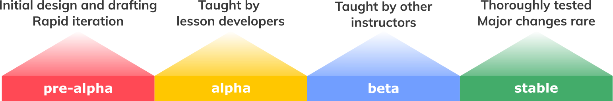

::::::::::::::::::::::::::::::::::::::: objectives

After completing this episode, participants should be able to...

- Explain the lesson design process we will be adopting for this course.
- Summarise the lessons that participants will be working on.

::::::::::::::::::::::::::::::::::::::::::::::::::

:::::::::::::::::::::::::::::::::::::::: questions

- What are the recommended steps to take when developing a new lesson?
- What lesson do you want to develop during and after this workshop?

::::::::::::::::::::::::::::::::::::::::::::::::::

## A Lesson Design Process

In order to design an effective lesson, we need a structured approach with the learner in mind and clearly identified goals. 
Throughout this training we will use a modified version of a process for curriculum design commonly referred to as _backward design_, described by Gill Nicholls[^1].
Following Nicholls' paradigm, we begin by defining exactly what you want your learners to be able to do _after they have completed the lesson/training/course_, with the subsequent stages involving the design and evaluation of content that will directly help learners meet those stated outcomes.
By defining at the beginning of the process what you want the outcomes to be at the end, you ensure that your efforts remain focused on those goals as you work.

This training promotes an iterative backward design process where, after identifying the target audience of our lesson, we

1. Define desired learning outcomes.
2. Design assessments to determine progress towards desired outcomes.
3. Write content to lead learners from one of these assessments to the next.
4. Assess learner progress towards outcomes during teaching.
5. (After the break) evaluate how closely the outcomes meet the objectives.

{
alt="A flow diagram presenting the process of lesson design and development used in this training."
width="67%"
}

### The process throughout this training
Note the cyclical nature of the process described above. By the time you have completed your certification as a Carpentries Lesson Developer, you will have completed one iteration through this cycle:

1. Define desired learning outcomes.
    * You will define learning objectives for your lesson as a whole and for individual sections.
2. Design assessments to determine progress towards desired outcomes.
    * You will learn about different types of assessment and how they can give you information about your learners' progress towards the defined objectives.
    * You will design and implement exercises that are appropriate to your target audience and the skills you want to teach them.
3. Write content to lead learners from one of these assessments to the next.
    * You will choose examples and a narrative that can help learners gain insight into the topic of your lesson.
    * You will begin to write content that is accessible, relevant, and appropriate for your target audience.
4. Assess learner progress towards outcomes during teaching.\*
    * You will deliver part of your new lesson and gather information about how effectively it teaches learners what they need to know.
5. Evaluate how closely the outcomes meet the objectives.\*
    * You will revisit your lesson design and content and make plans to update it, based on your own reflections and the feedback you gathered from learners.

Teaching the new lesson content is an essential intermediate step in the process and the steps marked with an asterisk (\*) will be completed after the training, as part of the checkout process for certification (more on which later).
The importance of gathering feedback and reflecting on teaching experience will be a common refrain throughout this training.

## Your Lessons

This training will provide many opportunities for discussion of your lessons.
Providing some context now for the lessons that you will be creating will help the Trainers and other participants get involved in those discussions and give you feedback as you follow the process.

:::::::::::::::::::::::::::::::::::::  discussion

## Discussion (10 minutes)

Share your answers to the following questions in the shared notes, then discuss them with the Trainers, your collaborators, and the other participants.

1. What is the topic of the lesson that you plan to develop based on this training?
2. Have you created training material on this topic before?
3. What is motivating you to create this lesson?

::::::::::::::::::::::::::::::::::::::::::::::::::

:::::::::::::::::::::::::::::::::::::::::::: instructor

## Trainer Note

Trainees should have received the questions above in advance and arrived at the training with notes prepared.
Where multiple trainees are working on the same lesson project, ask for a volunteer or call on someone to represent their team, leaving space afterwards for their team-mates to speak up if their answers differ.

The main objectives of this discussion are:

- to ensure that the members of each collaborative team share a common vision for the lesson they want to create
- to help Trainers and collaborators understand each trainee's motivation for attending the training and building their lesson

:::::::::::::::::::::::::::::::::::::::::::::::::::::::

## Iterative Development

The Carpentries community develops open source lessons, which can always be updated and may never be _finished_.
A lesson can undergo many iterations before it reaches a relatively stable state.
To reflect this, we encourage lesson developers to indicate the status of their lesson by labelling its progress through a _lesson life cycle_:

{
alt="Diagram of the life cycle of a lesson in The Carpentries ecosystem.
A lesson is proposed at the beginning of the pre-alpha stage.
It enters alpha when it is taught for the first time. 
In beta, it is taught by other instructors. A full release of the lesson is made when it is stable.
Pilot workshops take place during the alpha and beta phases."}

Each life cycle stage indicates the level of maturity of a lesson:

- **pre-alpha**: a first draft of the lesson is still being constructed.
- **alpha**: the lesson has been/is being taught by the original authors, but has not been fully tested.
- **beta**: the lesson is ready to be taught by instructors who have not been significantly involved in its development to this point.
- **stable**: the lesson has been extensively tested by the authors and others. It can be considered broadly complete and unlikely to undergo any drastic changes without warning.

Although your lessons will probably remain in pre-alpha throughout this training, some of the content will be equally valuable at later stages and we will also point you towards resources to help with testing the lesson and gathering feedback.

[The Carpentries Community Handbook](https://docs.carpentries.org/) provides [more information about the lesson life cycle](https://docs.carpentries.org/resources/curriculum/lesson-life-cycle.html).

## Lesson Design Notes Template

At this point, the Trainers will share a [template document for Lesson Design Notes][design-notes-template] with trainees.
Trainees should make a copy of this document and fill in their lesson title.
They will populate other parts of the document with the notes and information they produce throughout the training.

:::::::::::::::::::::::::::::::::::::::: keypoints

- We will learn to develop lessons based on the (slightly adapted) Nicholls' backward lesson design  process.
- There can be many reasons to create a new lesson.
- This training will give you a process to follow to ensure your lesson is effective.

::::::::::::::::::::::::::::::::::::::::::::::::::

[^1]: [Nicholls (2002)](learners/reference.md#litref)
