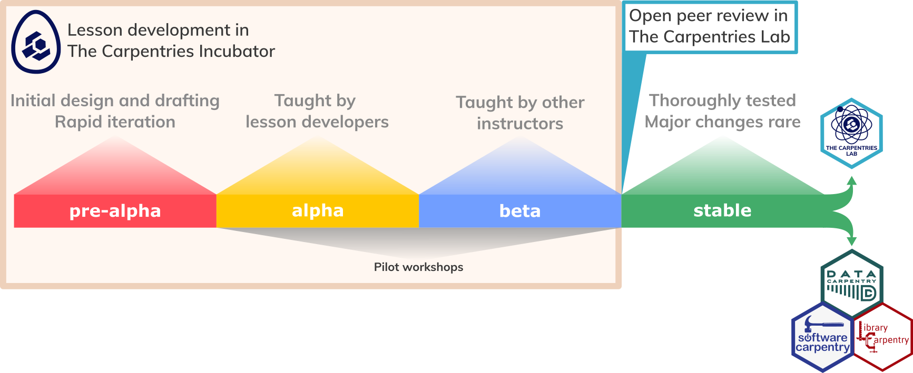

::::::::::::::::::::::::::::::::::::::: objectives

After completing this episode, participants should be able to...

- Describe the role that feedback plays in the life cycle of a lesson.
- Connect with other members of the community.

::::::::::::::::::::::::::::::::::::::::::::::::::

:::::::::::::::::::::::::::::::::::::::: questions

- What are the important milestones in the development of a new lesson?
- How can The Carpentries lesson development community help me complete my lesson?

::::::::::::::::::::::::::::::::::::::::::::::::::

Until now, this training has focused on the internals of a lesson development project.
Now it is time to consider the evolution of a lesson over time, 
and the context in which lesson development can take place.

## The Lesson Life Cycle Revisited

At the beginning of this training,
you were introduced to the concept of a lesson life cycle,
which The Carpentries promotes to help developers communicate 
the status of an open source lesson project to instructors and learners.

{
alt="The life cycle of a lesson in The Carpentries ecosystem, 
annotated to indicate the platforms provided for lesson projects at each stage of the cycle.
In the diagram includes the pre-alpha, alpha, beta, and stable stages described earlier,
and icons showing that pre-alpha through beta development of lessons happens in The Carpentries Incubator,
while The Carpentries Lab hosts peer-reviewed lessons and provides a platform for open peer review.
Stable lessons may also be adopted into an official lesson program of The Carpentries."}

### Indicating Your Lesson's Progress

The life cycle stage of a lesson is displayed as a banner on the lesson site,
as a label on the lesson GitHub repository,
and alongside the lesson whenever it is shown on The Carpentries websites
and lesson listings.

The life cycle stage for a lesson is configured in the `config.yaml` file we
encountered when we were first introduced to [The Carpentries Workbench](infrastructure.md),
as a value for the `life_cycle` field.
For new lesson repositories, this value is already set to 'pre-alpha',
so you should not have to change it yet.

::: callout
### The `carpentry` Field

The `config.yaml` file also contains a `carpentry` field, which can be used to adjust
the styling applied to a lesson website e.g. to make it look like a lesson from the
Software, Library, or Data Carpentry Lesson Programs.

For community-developed lessons, where no official relationship exists with one of these
Lesson Programs, you should keep using the `incubator` setting, before potentially switching
over to another styling when the lesson moves e.g. into The Carpentries Lab.

:::::::::::

### Pathways out of Lesson Incubation

The Carpentries provides pathways for mature lessons to leave the Incubator.

1. A mature lesson may **join an existing lesson program**, 
   e.g. Data Carpentry, Library Carpentry, or Software Carpentry,
   subject to review and approval by the relevant [Curriculum Advisory Committee][curriculum-advisors].
2. Developers can submit their lessons for **open peer review** in [The Carpentries Lab][carpentries-lab],
   which hosts a growing collection of high-quality, stable lessons created by the community.
   Developers submitting to the Lab have the option of publishing their lesson in 
   [The Journal of Open Source Education (JOSE)][jose].

A lesson does not need to be stable to be useful to the community:
lessons with alpha and beta status are already valuable resources to be taught and reused.

## Pilot Workshops

::::::::::::::::::::::::::::::::::::::::::::::: testimonial

"No lesson survives first contact with learners".

--- [Greg Wilson](https://third-bit.com/talks/writing-book/#19)

:::::::::::::::::::::::::::::::::::::::::::::::::::::::::::

In line with [the importance we placed on evaluation of lesson content earlier in this training](audience.md),
the life cycle described above places considerable emphasis on
the testing of lessons in **pilot workshops**.

For these pilot workshops to provide an effective evaluation of the lesson,
it is essential to seize the opportunity they provide to collect feedback and data.
For example, a pilot workshop offers a chance to answer questions like:

- How much time does it take to teach each section of the lesson?
- How much time is required for each exercise?
- What technical issues were encountered during the lesson?
- What questions did learners ask during the workshop?
- Which parts of the lesson were confusing for learners?
- Which exercises could be improved to provide more information to the instructors?

[The pilot workshop notes template][pilot-notes-template] provides a starting point,
but it takes a lot of time and effort to keep track of all this information
during a pilot workshop.
It can be helpful to assign this task to a member of the lesson development team,
who can dedicate themselves to observing the pilot and taking notes.
As soon as the pilot has finished,
it is a good idea to take some time to share the notes with the other lesson authors,
to reflect on and discuss the experience of teaching the lesson,
and to synthesise the lesson notes and any action items that come from this debrief
into specific action items to improve the lesson.
These should be added as new issues on the lesson repository,
to help you keep track of the work that needs doing for the next iteration.

For beta pilot workshops,
where the lesson is taught by instructors who have not yet made a major contribution to its development,
it is vital that instructors have the opportunity before the workshop
to learn about the lesson from the authors,
and to debrief with the authors afterwards so that they can
share their experience and observations about how the lesson could be further improved.

::: callout

## Hosting and Teaching Pilot Workshops

The Carpentries community handbook includes
[guidance for community members who want to teach and/or host pilot workshops][handbook-pilot-workshops].

:::::::::::

## Connecting with the Lesson Developer Community

[The Carpentries Incubator][carpentries-incubator] hosts a thriving community of lesson developers,
working on lesson projects at every stage of the life cycle.

You can add your lesson project(s) to the Incubator by submitting an issue
to [the Incubator Proposals repository][incubator-proposals].
Lesson developers working in the Incubator benefit from 
increased visibility for their projects 
and dedicated support from The Carpentries team.

Connecting with the lesson developer community can be a great way to
find collaborators to contribute to or test your lesson,
to stay up to date with the latest support provided to the community,
and to learn from the experience of others.

Here are a community activities and channels that you might be interested in joining:

- The `lesson-dev` channel on [The Carpentries Slack workspace](https://slack-invite.carpentries.org/). This is a platform for the community to ask questions and make announcements about lesson development. You could also browse the other channels on the workspace for any that are relevant to the topic of your lesson.
  - You may also find it helpful to create a new channel on Slack for discussion of your lesson. Chat channels like this can be valuable ways for a remote team to communicate and collaborate.
- [The `incubator-developers` list on TopicBox](https://carpentries.topicbox.com/groups/incubator-developers). The Carpentries Curriculum Team uses this mailing list to make relevant announcements to the community of lesson developers working in Incubator.
- The Carpentries Curriculum Team hosts monthly Lesson Development Coworking Sessions, which are a good opportunity to engage with other lesson developers and make regular progress on your project. The sessions are listed on [The Carpentries community calendar](https://carpentries.org/community/#community-events).

::::::::::::::::::::::::::::::::::::::  challenge

## Exercise: join relevant channels (5 minutes)

Use this time to explore the options listed above
and join/subscribe to any communication channels that you find interesting.

::::::::::::::::::::::::::::::::::::::::::::::::::

:::::::::::::::::::::::::::::::::::::::: keypoints

- Teaching a lesson for the first time is an essential intermediate step in the lesson development process.
- The Carpentries lesson developer community shares their experience on multiple communication channels.

::::::::::::::::::::::::::::::::::::::::::::::::::
